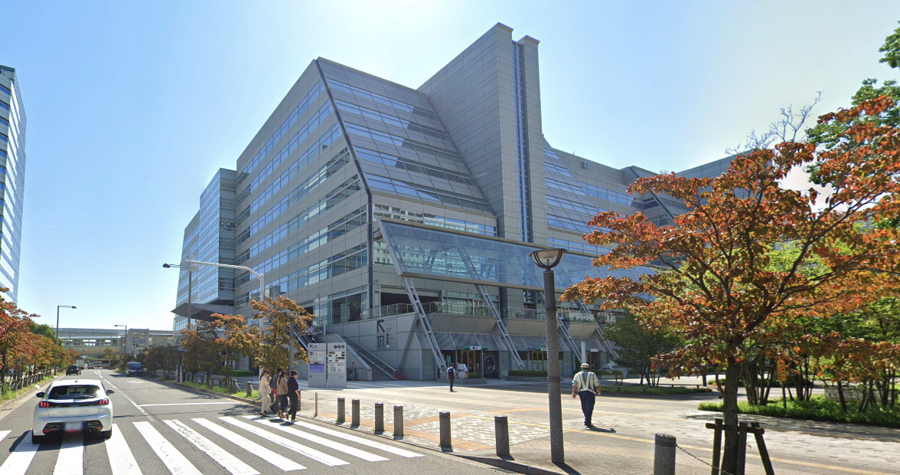
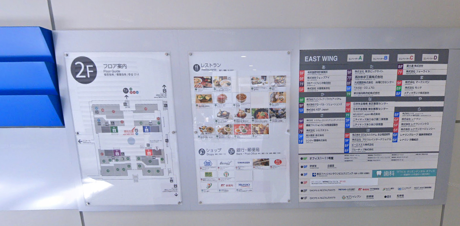
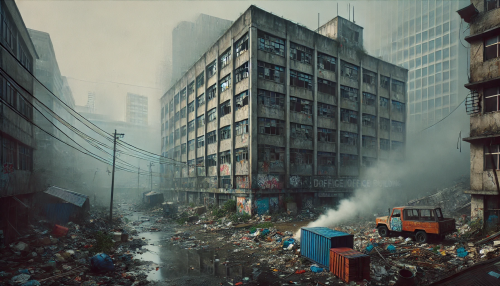

# 建筑外观与用户界面设计

## 章节说明

我们去一个新的地方的时候，比如说到东软日本本部来面试。

到了有明建筑物，我们第一眼会看到这个建筑是什么风格，材质，以及出入口到哪里。

进入建筑物之后，我们会试图找到楼梯或电梯到达7楼。

到达7楼后，会试图根据建筑内的楼层指示图，向指示的方向去寻找东软日本。

在看到了东软日本的Logo后，确认了这里就是东软日本的办公室。

### 思考

如果东软日本办公室位于以下的图片中，你会有何感想。

如果有明办公楼里面没有导航， 你又如何感想？

## 1. 建筑外观的设计重要性

建筑的外观设计是人们对建筑物的第一印象，直接影响人们对建筑物的整体评价。

建筑风格、建筑年限、使用材质和外观整洁度等因素共同决定了建筑的外观。

- 建筑风格：不同的建筑风格传递出不同的文化和情感。
    > 现代风格的建筑通常使用玻璃和钢材，线条简洁、造型前卫，给人以创新、开放的感觉；而古典风格的建筑则多用石材和雕刻，展现出庄重、历史感。
- 建筑年限：新建筑和历史建筑的外观反映出不同的时代特点。新建筑通常看起来更时尚和现代，而历史建筑则可能显得更有故事和文化积淀。
- 使用材质：建筑外墙的材料选择对外观有很大影响。玻璃、钢材、砖石和木材等不同材料能带来截然不同的视觉效果。
- 外观整洁度：整洁的外观能给人留下良好的印象，反之则会让人觉得这个建筑缺乏维护。

## 2. 用户界面设计的重要性

软件的用户界面是用户与系统交互的第一窗口。一个好的用户界面设计能够提升用户体验，增加用户的满意度和忠诚度。

- 简洁：简洁的设计能够减少用户的认知负担，让用户更容易找到他们需要的信息和功能。
- 直观：直观的设计让用户能够轻松上手，无需花费大量时间去学习和适应。
- 易用：易用的界面设计能够提高用户的操作效率，让用户在使用软件时感到舒适和愉快。

## 3. 建筑外观设计与用户界面设计的对比
建筑的外观设计和软件的用户界面设计有很多相似之处，都是给用户留下第一印象的关键因素。

- 视觉吸引力：无论是建筑还是软件，一个引人注目的设计都能吸引用户的注意力。
  > 悉尼歌剧院和Google主页都通过简洁、独特的设计来吸引用户。
- 功能性：建筑和软件的设计不仅要美观，还要功能齐全。
  > 埃菲尔铁塔不仅是一座纪念碑，也是一座电台发射塔。Instagram的界面设计不仅美观，还具备强大的社交功能。